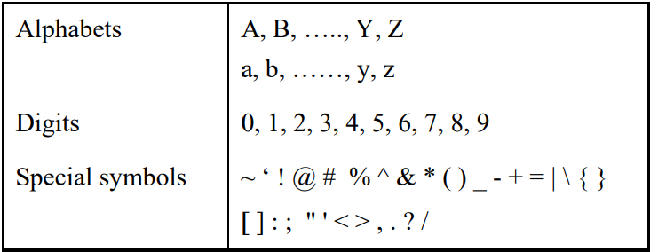
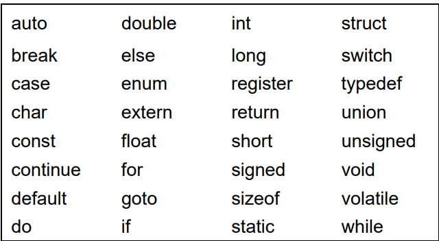
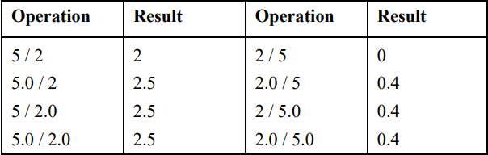
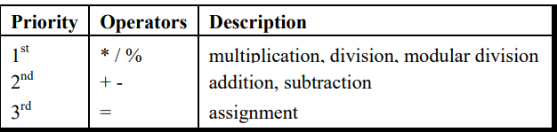
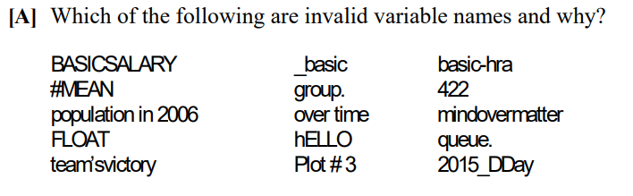

# Getting Started

## What is C

- C is a programming language developed at AT & T’s Bell Laboratories of USA in 1972. 
- It was designed and written by a man named Dennis Ritchie.

## Getting Started with C

- Communicating with a computer involves speaking the language
the computer understands, which immediately rules out English as
the language of communication with computer. 
- The classical method of learning English is to first learn
the alphabets used in the language, then learn to combine these
alphabets to form words, which in turn are combined to form
sentences and sentences are combined to form paragraphs.
- Learning C is similar and easier.

### The C Character Set

- A character denotes any alphabet, digit or special symbol used to
represent information.

- 

### Constants , Variables and Keywords

- The alphabets, numbers and special symbols when properly
combined form constants, variables and keywords.
- A constant is an entity that
doesn’t change whereas a variable is an entity that may change. 

### Types of C Constants

- Primary Constants
    - Integer Constant
    - Real Constant
    - Character Constant

- Secondary Constants
    - Array
    - Pointer
    - Structure
    - Union
    - Enum

### Rules for Constructing Integer Constants

- must have digit
- must not have decimal point
- either poistive or negative
- no sign precedes then assumed positive
- no comma or blanks allowed
- ranges –32768 to 32767 (for 16-bit compiler, depends on complier ).

### Rules for Constructing Real Constants

- also called Floating point constants 
- can be written in two forms
    - Fractional
    - Exponential
- must have atleast one digit
- have decimal point
- could be positive or negative
- no comma or blank allowed

### Rules for Constructing Character Constants

- a single alphabet or a special symbol ot a single digit enclosed within single inverted commas
- maximum length = 1

### Types of C Variables

- Variable names are names given to locations in memory.
- a particular type of variable can hold only the same type of constant

### Rules for Constructing Variable Names

- A variable name is any combination of 1 to 31 alphabets, digits or underscores
- The first character in the variable name must be an alphabet or underscore. 
- No commas or blanks allowed
- No special symbol other than underscore can be used
- Compiler distinguishes Primary and Secondary variable by the type with which its defined
- Create meaningful variable names

### C Keywords

- Keywords are the words whose meaning has already been explained to the C compiler (or in a broad sense to the computer)
- Keywords cannot be used as variable name ( even if compiler allows safer not to mix up)
- Keywrods also known as Reversed words
- 32 keywords in C
- 
- some other keywords are provided by Vendors like Microsoft, Borland but ANSI has suggested to put two underscores before them to identify them.

## The First C Program

- Rules : 
    - Each instruction is written as separate statement , so a complete program is a series of statements
    - the statements should be in a order in which they need to be executed, unleass it needs a deliberate jump / transfer
    - every statement must end with semi-colon `;` , acts as a statement terminator
- [Program to Calculate Simple Interest](./Program_to_Calculate_Simple_Interest.c)
- Comment about the program should be enclosed within `/* */`
- Good to add comments wherever required which increases readablity
- `main` is a name given to a set of statments enclosed with pair of braces, technically speaking main() is a function.
- Variable to be used must be declared beforehand
- C has 45 operators but no operator for exponentiation
- We use inbuilt function to display output on the screen, one such function is printf()
    - `printf("format string", list of variables);`
    - `%d` for integer
    - `%c` for characters
    - `%f` for real values
- Another one is `\n` , it is called newline and used ti take cursor to the next line, so  you get output split over two lines.

## Compilation and Execution

- The program typed needs to be converted to machine language(0s and 1s)
- This work is done by compiler
- On compiling its machine equivalent is stored as an [EXE file](./Program_to_Calculate_Simple_Interest.exe) on the disk
- This file called as an executable file can be copied to any other machine and can be executed there without being required to recomplie it.
- In fact ther machine need not even have a compiler to be able to execute the file.

## Receiving Input

- In earlier program we had values of p, n, r set already
- Its better to make general enough to work for any set of values
- `scanf()` helps us get values from user / keyboard.
- [Simple Interest with Input](./Simple_Interest_with_Input.c)
- the ampersand (&) before the variables in the scanf() function is a must. & is an ‘Address of’ operator.
- It gives the location number used by the variable in memory. 
- When we say &a, we are telling scanf( ) at which memory location should it store the value supplied by the user from the keyboard. 

## C Instructions

- Types of Instructions
    - Type Declaration Instructions
        - To declare variables
    - Arithmetic Instruction
        - To perform aeritmetic operations on variables
    - Control Instruction
        - Control sequence of execution of various statements

### Type Declaration Instruction

- This instruction is used to declare the type of variables being used
in the program
- The order in which we define the variables is sometimes
important sometimes not.
    - int i = 10, j = 25 ; is same as int j = 25, j = 10 ; 
    - However,  
        float a = 1.5, b = a + 3.1 ; is alright, but 
        float b = a + 3.1, a = 1.5 ; is not.  
        This is because here we are trying to use a even before defining it
    - The following statements would work  
        int a, b, c, d ; 
        a = b = c = 10 ; 
        However, the following statement would not work 
        int a = b = c = d = 10 ; 
        Once again we are trying to use b (to assign to a) before
        defining it. 

### Arithmetic Instruction

- A C arithmetic instruction consists of a variable name on the left
hand side of = and variable names & constants on the right hand
side of =.
- Could be of 3 Types
    - Integer mode arithmetic statement
        - all operands are integer variables or integer constants
        - int i, king, issac, noteit; 
            i = i + 1  
            king = issac * 234 + noteit - 7689

    - Real mode arithmetic statement
        - all operands are either real constants or real variables
        - float qbee, antink, si, prin, anoy, roi;  
            qbee = antink + 23.123 / 4.5 * 0.3442;  
            si = prin * anoy * roi / 100.0
    - Mixed mode arithmetic statement
        - some oprands are integers ans some are real
        - float si, prin, anoy, roi, avg;  
            int a, b, c, num;  
            si = prin * anoy * roi / 100.0;  
            avg (a + b + c + num) / 4;
- Arithmetic operations can be performed on ints, floats and
chars
- the addition is performed on the ASCII values of the characters and not on characters
themselves

### Integer and Float Conversions

- An arithmetic operation between an integer and integer
always yields an integer result
- An operation between a real and real always yields a real
result
- An operation between an integer and real always yields a real
result. In this operation the integer is first promoted to a real
and then the operation is performed. Hence the result is real.
- 
- When type of variable is not same on left and right of =, then value of expression is promoted or demoted as per left variable
    - int i;  
        float b; 
        i = 3.5;  
        b = 30; 
        here thr float value (3.5) will be demoted to an int (3) and int value (30) will be promoted to float value(30.000000).

### Heirarchy of Operations

- The priority or precedence in which the operations in an arithmetic statement are performed is called the hierarchy of
operations
- 
- If there are more than onde set of parentheses then innermost executes first

### Associativity of Operators 

- When an expression contains two operators of equal priority the tie between them is settled using the associativity of the operators.
- Two types
    - Left to Right
        - Left operand must be unambigous
        - Unambiguous - must not involve in evaluation of other sub-expression
    - Right to Left
        - Right operand must be unambiguous

## Control Instructions in C

- Control instructions determine the ‘flow of control’ in a program
- Types include : 
    - Sequence Control Instruction
        - ensures instructions are executed in same order in which they appear
    - Selection or Decision Control Instruction
        - Helps take a decision as to which instruction is to be executed next
    - Repetition or loop Control Instruction
        - Helps exeute a group of statements repeatedly
    - Case Control Instruction

## Exercise

- 
    - basic-hra, #MEAN, 422, group., population in 2006 , over time, queue., team’svictory, Plot # 3, 2015_DDay
    - [refer](#rules-for-constructing-variable-names)

- [B]
    - (a) keyword used as variable
    - (b) String used in char
    - (c) OK
    - (d) left side of = should only have one variable
    - (e) parentheses imbalence
    - (f) blanks in variable names
    - (g) OK
    - (h) C does not have exponentiation operator (** is invalid [refer](#arithmetic-instruction))
    - (i) C does not have exponentiation operator (^ is invalid [refer](#arithmetic-instruction))
    - (j) OK
    - (k) using b before assigning
    - (l) OK
    - (m) String used in char

- [C]
    - (a) g = big / 2 + big * 4 / big - big + abc / 3 ; (abc = 2.5, big = 2, assume g to be a float)
        | State| Operation |
        | :------------ | :-----------: |
        | g = 2 / 2 + 2 * 4 / 2 - 2 + 2.5 / 3; | |
        | g = 1 + 2 * 4 / 2 - 2 + 2.5 / 3; | operation / |
        | g = 1 + 8 / 2 - 2 + 2.5 / 3; | operation * |
        | g = 1 + 4 - 2 + 2.5 / 3.0; | operation /  |
        | g = 1 + 4 - 2 + 0.0; | operation / |
        | g = 5 - 2 + 0.0; | operation + |
        | g = 3 + 0.0; | operation - |
        | g = 3; | operation + |
        | g = 3.0; | g is float |
    
    - (b) on = ink * act / 2 + 3 / 2 * act + 2 + tig ; (ink = 4, act = 1, tig = 3.2, assume on to be an int)
        | State | Operation |
        | :----- | :-----: |
        | on = 4 * 1 / 2 + 3 / 2 * 1 + 2 + 3.2 ; | |
        | on = 5 / 2 + 3 / 2 * 1 + 2 + 3.2 ; | operation *|
        | on = 2 + 3 / 2 * 1 + 2 + 3.2 ; | operation /|
        | on = 2 + 1 * 1 + 2 + 3.2 ; | operation /|
        | on = 2 + 1 + 2 + 3.2 ; | operation *|
        | on = 3 + 2 + 3.2 ; | operation +|
        | on = 5 + 3.2 ; | operation +|
        | on = 8.2 ; | operation +|
        | on = 8 ; | on is int|

    - (c) s = qui * add / 4 - 6 / 2 + 2 / 3 * 6 / god ;(qui = 4, add = 2, god = 2, assume s to be an int) 
        | State | Operation | 
        | :----- | :----: |
        | s = 4 * 2 / 4 - 6 / 2 + 2 / 3 * 6 / 2 ; | |
        | s = 8 / 4 - 6 / 2 + 2 / 3 * 6 / 2 ; | operation *|
        | s = 2 - 6 / 2 + 2 / 3 * 6 / 2 ; | operation /|
        | s = 2 - 3 + 2 / 3 * 6 / 2 ; | operation /|
        | s = 2 - 3 + 0 * 6 / 2 ; | operation /|
        | s = 2 - 3 + 0 / 2 ; | operation *|
        | s = 2 - 3 + 0 ; | operation /|
        | s = -1 + 0 ; | operation -|
        | s = -1 ; | operation +|

    - (d) s = 1 / 3 * a / 4 - 6 / 2 + 2 / 3 * 6 / g ; (a = 4, g = 3, assume s to be an int) 
        | State | Operation |
        | :----- | :-------: |
        | s = 1 / 3 * 4 / 4 - 6 / 2 + 2 / 3 * 6 / 3 ; | | 
        | s = 0 * 4 / 4 - 6 / 2 + 2 / 3 * 6 / 3 ; | operation /| 
        | s = 0 / 4 - 6 / 2 + 2 / 3 * 6 / 3 ; | operation *| 
        | s = 0 - 6 / 2 + 2 / 3 * 6 / 3 ; | operation /| 
        | s = 0 - 3 + 2 / 3 * 6 / 3 ; | operation /|
        | s = 0 - 3 + 1 * 6 / 3 ; | operation /|
        | s = 0 - 3 + 6 / 3 ; | operation *|
        | s = 0 - 3 + 2 ; | operation /|
        | s = - 3 + 2 ; | operation -|
        | s = - 1 ; | operation +|

- [D]
    | Operator | Left | Right | Remark |
    |  :----: | :-----: | :----: | :------ |
    | / | 10 | 5 or 5 / 2 / 1 | Left operand is unambiguous, Right is not |
    | * | 5 | 4 or 4 / 3 | Left operand is unambiguous, Right is not | 
    | = | a | b or b = c = 3 + 4 | Left operand is unambiguous, Right is not |

- [E]
    - (a) 
        - Z = ((8.8 * (a + b) * 2) / c - (0.5 + 2 * a) / ( q + r )) / ((a + b) * (1/m))
    
    - (b) 
         - X = (-b + ( b * b) + 2 * 4 * a * c) / (2 * a)

    - (c) 
        - R = (2*v + (6.22 * (c + d))) / ( g + v )
    
    - (d)
        - A = (((7.7 * b) ((x * y) + a))/ c = 0.8 + (2 * b)) / ((x + a) * ( a / y))

    
- [F]
    - (a) 
        - 0 2 0.000000 2.000000
    
    - (b)
        - a = -6 b = 0
    
    - (c)
        - invalid operands to binary % (have 'float' and 'float')

    - (d) 
        - nn      
          &nbsp; nn     
            nn /n/n nn/n
        
    - (e) 
        - Enter values of a and b5 10   
            a = 5 b = 10

    - (f)
        - Enter values of p and q2 3

- [G]
    - (a) C language has been developed by 
        - (2) Dennis Ritchie
    - (b) C can be used on
        - (4) All the above
    - (c) C programs are converted into machine language with the help of
        - (2) A compiler
    - (d) The real constant in C can be expressed in which of the following forms
        - (4) Both Exponential forms
    - (e) A character variable can at a time store
        - (1) 1 character
    - (f) The statement char ch = ‘Z’ would store in ch
        - (1) the character Z
    - (g) Which of the following is NOT a character constant
        - (4) All the above
    - (h) The maximum value that an integer constant can have is
        - (2) 32767
    - (i) A C variable cannot start with
        - (4) Both (2) and (3) above
    - (j) Which of the following statement is wrong 
        - (4) 3 + a = b
    - (k) Which of the following shows the correct hierarchy of arithmetic operators in C
        - (4) / or *, - or +
    - (l) In b = 6.6 / a + 2 * n ; which operation will be performed first?
        - (1) 6.6 / a
    - (m) Which of the following is allowed in a C Arithmetic instruction
        - (3) ()
    - (n) Which of the following statements is false 
        - (1) Each new C instruction has to be written on a separate line 
    - (o) If a is an integer variable, a = 5 / 2 ; will return a value
        - (3) 2
    - (p) The expression, a = 7 / 22 * ( 3.14 + 2 ) * 3 / 5 ; evaluates to
        - (4) 0
    - (q) The expression, a = 30 * 1000 + 2768 ; evaluates to
        - (1) 32768
    - (r) The expression x = 4 + 2 % - 8 evaluates to
        - (2) 6
    - (s) Hierarchy decides which operator 
        - (2) is used first
    - (t) An integer constant in C must have: 
        - (1) At least one digit
    - (u) A character variable can never store more than 
        - (4) 1 character 
    - (v) In C a variable cannot contain
        - (4) All the above
    - (w) Which of the following is FALSE in C
        - (1) Keywords can be used as variable names 
    - (x) In C, Arithmetic instruction cannot contain 
        - (4) constants on left side of = 
    - (y) Which of the following shows the correct hierarchy of arithmetic operations in C 
        - (4) * / + - 
    - (z) What will be the value of d if d is a float after the operation d = 2 / 7.0? 
        - (2) 0.285714

- [H] Write C programs for the following:
    - (a) Ramesh’s basic salary is input through the keyboard. His dearness allowance is 40% of basic salary, and house rent allowance is 20% of basic salary. Write a  program to calculate his gross salary.
        - [C program](./Ramesh_gross_salary.c)
    - (b) The distance between two cities (in km.) is input through the keyboard. Write a program to convert and print this distance in meters, feet, inches and centimeters.
        - [C program](./Distance_between_cities.c)
    - (c) If the marks obtained by a student in five different subjects are input through the keyboard, find out the aggregate marks and percentage marks obtained by the student. Assume that the maximum marks that can be obtained by a student in each subject is 100
        - [C Program](./Student_marks.c)
    - (d) Temperature of a city in Fahrenheit degrees is input through the keyboard. Write a program to convert this temperature into Centigrade degrees.
        - [C Program](./Fahrenheit_Degree.c)
    - (e) The length & breadth of a rectangle and radius of a circle are input through the keyboard. Write a program to calculate the area & perimeter of the rectangle, and the area & circumference of the circle.
        - [C Program](./Area_Perimeter.c)
    - (f) Two numbers are input through the keyboard into two locations C and D. Write a program to interchange the contents of C and D.
        - [C Program](./Interchange_Numbers.c)
    - (g) If a five-digit number is input through the keyboard, write a program to calculate the sum of its digits. 
        - [C Program](./Sum_of_Digits.c)
    - (h) If a five-digit number is input through the keyboard, write a program to reverse the number. 
        - [C Program](./Reverse_Number.c)
    - (i) If a four-digit number is input through the keyboard, write a program to obtain the sum of the first and last digit of this number. 
        - [C Program](./First_and_Last.c)
    - (j) In a town, the percentage of men is 52. The percentage of total literacy is 48. If total percentage of literate men is 35 of  the total population, write a program to find the total number of illiterate men and women if the population of the town is 80,000.
        - [C Program](./Illiteracy_in_Village.c)
    - (k) A cashier has currency notes of denominations 10, 50 and 100. If the amount to be withdrawn is input through the keyboard in hundreds, find the total number of currency notes of each denomination the cashier will have to give to the withdrawer. 
        - [C Program](./Cashier_denomination.c)
    - (l) If the total selling price of 15 items and the total profit  earned on them is input through the keyboard, write a program to find the cost price of one item. 
        - [C Program](./Cost_Price.c)
    - (m) If a five-digit number is input through the keyboard, write a program to print a new number by adding one to each of its digits. For example if the number that is input is 12391 then the output  should be displayed as 23402. 
        - [C Program](./Add_One_to_NumDigits.c)