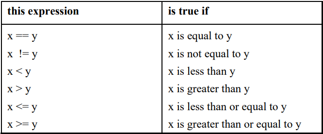
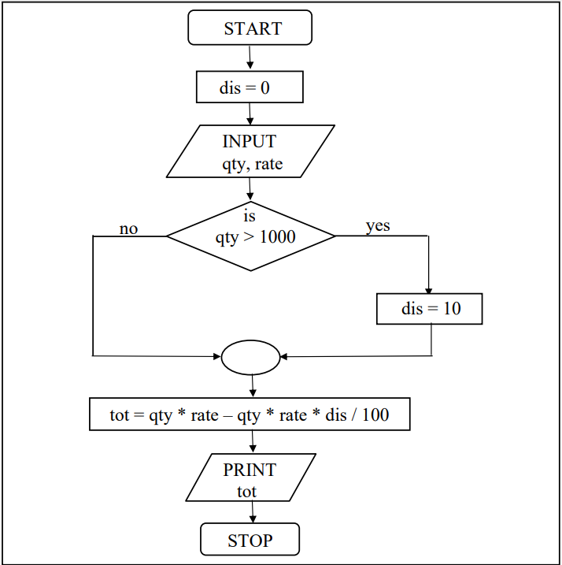
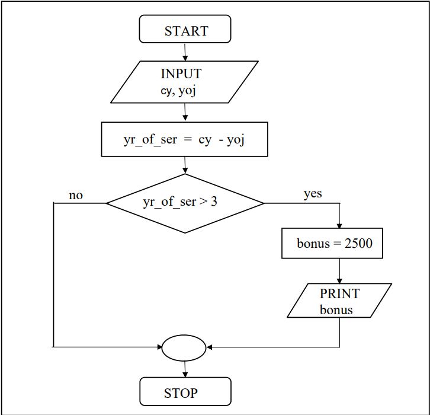
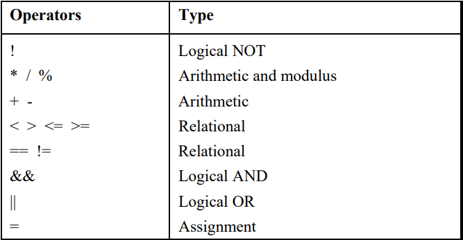

# The Decision Control Structure

- Three major decision making instrucitons in C :
    - if
    - if-else
    - switch 
    - (some what less important) conditional operators 

## Decisions! Decisions!

- By default the instructions in a program are executed sequentially.
- Many a times, we want a set of instructions to be executed in one situation, and an entirely different set of instructions to be executed in another situation. 

## The <i><b>if</b></i> Statement 

```
if( this condition is true )
    execute this statement;
```
- Example :  we express a condition using C’s ‘relational’ operators:
    - The relational operators allow us to compare two values to see whether they are equal to each other, unequal, or whether one is greater than the other.
    
    - While purchasing certain items, a discount of 10% is offered if the quantity purchased is more than 1000. If quantity and price per item are input through the keyboard, write a program to calculate the total expenses
    - [C Program](./totalExpenses.c) <br><br>
    

### The Real Thing

General form of <i><b>if</b></i> statement is : 
```
if(expression)
    statement;
```
- the expression can be any valid expression including a relational expression
- We can even use arithmetic expressions in the if statement.

- In C, non-zero value is considered to be true, whereas 0 is considered to be false.
- -5, 3.14, 10 would be considered to be true.
-  So the issue is not whether the number is integer or float, or whether it is positive or negative. Issue is whether it is zero or non-zero. 

### Multiple Statements within <i><b>if</b></i>

- if multiple statements are to be executed then they must be placed within pair of braces
- Example : The current year and the year in which the employee joined the organization are entered through the keyboard. If the number of years for which the employee has served the organization is greater than 3 then a bonus of Rs. 2500/- is given to the employee. If the years of service are not greater than 3, then the program should do nothing.
    - [C Program](./code/Bonus.c) <br><br>
    

## The <i><b>if-else</b></i> Statement

- else statement helps to executes another group of statements if the expression evaluates to false
- Example : In a company an employee is paid as under: <br>
    If his basic salary is less than Rs. 1500, then HRA = 10% of basic salary and DA = 90% of basic salary. If his salary is either equal to or above Rs. 1500, then HRA = Rs. 500 and DA = 98% of basic salary. If the employee's salary is input through the keyboard write a program to find his gross salary. 
    - [C Program]() <br><br>
    


### Nested <i><b>if-else</b></i>

```
main()
{
	int i;
	printf("Enter either 1 or 2");
	scanf("%d", &i)

	if(i == 1){
		printf("You would go to heaven!");
	}else{
		if(i == 2)
			printf("Hell was created with you in mind");
		else
			printf("How about mother earth!");
	}
}
```


### Forms of <i><b>if</b><i>

```
if ( condition )
    do this;
```
```
if ( condition )
{
    do this;
    and this;
}

```
```
if ( condition )
    do this;
else
    do this;
```
```
if ( condition )
{
    do this;
    and this;
}
else
{
    do this;
    and this;
}
```
```
if ( condition )
    do this;
else
{
    if ( condition )
        do this;
    else
    {
        do this;
        and this;
    }
}
```
```
if ( condition )
{
    if ( condition )
        do this ;
    else
    {
        do this ;
        and this ;
    }
}
else
    do this ; 
```

## Use of Logical Operators

- C allowes three logical operators : && (AND), || (OR), ! (NOT).
- Don’t use the single symbol | and &. These single symbols also have a meaning.
-  The first 2 operators allowd us to combine 2 or more condition in an <i><b>if</b></i> Statement.
- Example : The marks obtained by a student in 5 different subjects are input through the keyboard. The student gets a division as per the following rules :<br>
Percentage above or equal to 60 - First division<br>
Percentage between 50 and 59 - Second division<br>
Percentage between 40 and 49 - Third division<br>
Percentage less than 40 - Fail<br>
Write a program to calculate the division obtained by the student.
    - [C Program (Method-I)](./code/divisionMethodOne.c)
    - As the number of conditions go on increasing the level of indentation also goes on increasing.
    - Care needs to be exercised to match the corresponding <i><b>if</b></i>s and <i><b>else</b></i>s
    - Care needs to be exercised to match the corresponding pair of braces
    - [C Program (Method-II)](./code/divisionMethodTwo.c)

### The <i><b>else if</b></i> Clause

```
/* else if ladder demo */
main()
{
    int m1, m2, m3, m4, m5, per;
	
	per = ( m1 + m2 + m3 + m4 + m5) / 5;

	if ( per >= 60 )
		printf("First division\n");
	else if ( per >= 50 )
		printf("Second division\n");
	else if ( per >= 40 )
		printf("Third division\n");
	else
		printf("Fail\n");
}
```
- The last else goes to work only if all conditions fail
- The else if clause is nothing different. It is just a way of rearranging the else with the if that follows it.
```
if (i == 2)
    printf("With you ....");
else
{
    if (j == 2)
        printf("...all the time");
}
```
```
if (i == 2)
    printf("With you...");
else if (j == 2)
    printf ("....All the time");
```

### The <b>!</b> Operator

- This operator reverses the result of the expression it operates on.
- if the expression evaluates to a non-zero value, then applying <b>!</b> operator to it results into a 0
- if the expression evaluates to a non-zero value, then applying <b>!</b> operator to it results into a 0


### Hierarchy of Operators Revisited



## A Word of Caution

```
main( )
{
    int i ;
    printf ( "Enter value of i " ) ;
    scanf ( "%d", &i ) ;
    if ( i = 5 )
        printf ( "You entered 5" ) ;
    else
        printf ( "You entered something other than 5" ) ;
}

Output
Enter value of i 200
You entered 5
Enter value of i 9999
You entered 5 
```
- As the condition written is wrong , it gets reduced to  <i><b>if ( 5 )</b></i> irrepective of what you supply  as the value of i.
- In C 'Truth' is always non-zero , whereas 'falsify' is always zero
- <i><b>if ( 5 )</b></i> always evaluates to true ad hence the result

## The Conditional Operators

- the conditional operators <i><b>?</b></i> and <i><b>:</b></i> are sometimes called ternary opertors since they take three arguments
```
expresion 1 ? expression 2 : expression 3
```
 - if expression 1 is true (that is, if its value is non-zero), then the value returned will be expression 2, otherwise the value returned will be expression 3
```
y = ( x > 5 ? 3 : 4);
```
- conditional operators can be nested
``` 
big = ( a > b ? ( a > c ? 3 : 4) : ( b > c ? 6 : 8 ));
```
- Check out the following conditional expression:
```
a > b ? g = a : g = b ;
```
- This will give you an error ‘Lvalue Required’. The error can
be overcome by enclosing the statement in the <i><b>:</b></i> part within a
pair of parenthesis. This is shown below:
```
a > b ? g = a : ( g = b ) ;
```
- In absence of parentheses the compiler believes that b is being
assigned to the result of the expression to the left of second =.
Hence it reports an error
 ## Exercise

- [A]
    - (a)
        - 0 200

    - (b)
        - 300 200

    - (c)
        - 10 20

    - (d)
        - 3<br>
        5

    - (e)
        - x and y are equal

    - (f)
        - x = 10 y = 10 z = 0

    - (g)
        - 0 50 0

    - (h)
        - C is WOW

    - (i)
        - a = 15 b = 15 c = 0

    - (j)
        - 1 20 1

- [B]
    - (a)
        - comparision operator is wrongly, but won't throw error

    - (b)
        - no error

    - (c)
        - no error

    - (d)
        - no such keyword `then`

    - (e)
        - expected parenthesis for condition of if

    - (f)
        - wrongly used comparator operator ,will throw `lvalue required as left operand of assignment`

    - (g)
        - x is less than y

    - (h)
        - `then` undeclared variable / keyword.

    - (i)
        - `else` without a previous `if`

- [C]
    - (a) If cost price and selling price of an item is input through the keyboard, write a program to determine whether the seller has made profit or incurred loss. Also determine how much profit he made or loss he incurred. 
        - [profitOrLoss](./code/profitOrLoss.c)
    
    - (b) Any integer is input through the keyboard. Write a program to find out whether it is an odd number or even number
        - [oddOrEven](./code/oddOrEven.c)

    - (c) Any year is input through the keyboard. Write a program to determine whether the year is a leap year or not.
        - [leapYearOrNot](./code/leapYearOrNot.c)

    - (d) According to the Gregorian calendar, it was Monday on the date 01/01/1900. If any year is input through the keyboard write a program to find out what is the day on 1st January of this year
        - [gregorianCalendar](./code/gregorianCalendar.c)

    - (e) A five-digit number is entered through the keyboard. Write a program to obtain the reversed number and to determine whether the original and reversed numbers are equal or not.
        - [reversedNumber](./code/reversedNumber.c)

    - (f) If the ages of Ram, Shyam and Ajay are input through the keyboard, write a program to determine the youngest of the three
        - [youngest](./code/youngest.c)

    - (g) Write a program to check whether a triangle is valid or not, when the three angles of the triangle are entered through the keyboard. A triangle is valid if the sum of all the three angles is equal to 180 degrees. 
        - [validTriangle](./code/validTriangle.c)

    - (h) Find the absolute value of a number entered through the keyboard.
        - [absoluteValue](./code/absoluteValue.c)

    - (i) Given the length and breadth of a rectangle, write a program to find whether the area of the rectangle is greater than its perimeter. For example, the area of the rectangle with length = 5 and breadth = 4 is greater than its perimeter.
        - [rectangle](./code/rectangle.c)

    - (j) Given three points (x1, y1), (x2, y2) and (x3, y3), write a program to check if all the three points fall on one straight line.
        - [straightLine](./code/straightLine.c)

    - (k) Given the coordinates (x, y) of a center of a circle and it’s radius, write a program which will determine whether a point lies inside the circle, on the circle or outside the circle.
        - [circle](./code/circle.c)

    - (l) Given a point (x, y), write a program to find out if it lies on the x-axis, y-axis or at the origin, viz. (0, 0).
        - [axis](./code/axis.c)

<br>

- Logical Operators
If a = 10, b = 12, c = 0, find the values of the expressions in
the following table: 

|Expression|Value|
|:-----|:------:|
|a != 6 && b > 5|1|
|a == 9 or b < 3|0|
|! ( a < 10 ) |1|
|! ( a > 5 && c ) |1|
| 5 && c != 8 or !c |1|

<br>

- [D] [refer](#hierarchy-of-operators-revisited)
    - (a)
        - Dean of students affairs

    - (b)
        - Let us C

    - (c)
        - w = 1 x = 0 y = 1 z = 1 

    - (d)
        - y = 1 z = 1

    - (e)
        - Bennarivo

    - (f)
        - 40

    - (g)
        - Definitely C !

    - (h)
        - 1 1

    - (i)
        - z is big

    - (j)
        - -1 1

    - (k)
        - k = 0


- [E]
    - (a)
        - no errors

    - (b)
        - single & is used which has different meaning than logical AND

    - (c)
        - no such keyword or ( only logical OR || is available in C)

    - (d)
        - next if statement with completing the first one / if in between condition

    - (e)
        - and is not  keyword in C , only logical AND (&&) is allowed

    - (f)
        - single & is used which has different meaning than logical AND

    - (g)
        - else without a if, if is already closed as semicolon is written after the condition

    - (h)
        - no errors

- [F]
    - (a) Any year is entered through the keyboard, write a program to determine whether the year is leap or not. Use the logical operators && and ||. 
        - [leapYearOperator](./code/leapYearOperator.c)
    
    - (b)Any character is entered through the keyboard, write a program to determine whether the character entered is a capital letter, a small case letter, a digit or a special symbol. 
        - [theCharacter](./code/theCharacter.c)

    - (c) An Insurance company follows following rules to calculate premium.<br>
    (1) If a person’s health is excellent and the person is between 25 and 35 years of age and lives in a city and is a male then the premium is Rs. 4 per thousand and his policy amount cannot exceed Rs. 2 lakhs.<br>
    (2) If a person satisfies all the above conditions except that the sex is female then the premium is Rs. 3 per thousand and her policy amount cannot exceed Rs. 1 lakh.<br>
    (3) If a person’s health is poor and the person is between 25 and 35 years of age and lives in a village and is a male then the premium is Rs. 6 per thousand and his policy cannot exceed Rs. 10,000.<br>
    (4) In all other cases the person is not insured.<br>
    Write a program to output whether the person should be insured or not, his/her premium rate and maximum amount for which he/she can be insured. 
        - [insuredOrNot](./code/insuredOrNot.c)

    - (d) A certain grade of steel is graded according to the following conditions: <br>
    (i) Hardness must be greater than 50<br>
    (ii) Carbon content must be less than 0.7<br>
    (iii) Tensile strength must be greater than 5600<br>
    The grades are as follows:<br>
    Grade is 10 if all three conditions are met<br>
    Grade is 9 if conditions (i) and (ii) are met<br>
    Grade is 8 if conditions (ii) and (iii) are met<br>
    Grade is 7 if conditions (i) and (iii) are met<br>
    Grade is 6 if only one condition is met<br>
    Grade is 5 if none of the conditions are met<br>
    Write a program, which will require the user to give values of hardness, carbon content and tensile strength of the steel under consideration and output the grade of the steel.
        - [gradepfSteel](./code/gradeOfSteel.c)
    
    - (e) A library charges a fine for every book returned late. For first 5 days the fine is 50 paise, for 6-10 days fine is one rupee and above 10 days fine is 5 rupees. If you return the book after 30 days your membership will be cancelled. Write a program to accept the number of days the member is late to return the book and display the fine or the appropriate message. 
        - [libraryFine](./code/libraryFine.c)
    
    - (f) If the three sides of a triangle are entered through the keyboard, write a program to check whether the triangle is valid or not. The triangle is valid if the sum of two sides is greater than the largest of the three sides. 
        - [validTriangleSides](./code/validTriangleSides.c)
    
    - (g) If the three sides of a triangle are entered through the keyboard, write a program to check whether the triangle is isosceles, equilateral, scalene or right angled triangle.
        - [triangleType](./code/triangleType.c)

    - (h) In a company, worker efficiency is determined on the basis of the time required for a worker to complete a particular job. If the time taken by the worker is between 2 – 3 hours, then the worker is said to be highly efficient. If the time required by the worker is between 3 – 4 hours, then the worker is ordered to improve speed. If the time taken is between 4 – 5 hours, the worker is given training to improve his speed, and if the time taken by the worker is more than 5 hours, then the worker has to leave the company. If the time taken by the worker is input through the keyboard, find the efficiency of the worker. 
        - [workerEfficiency](./code/workerEfficiency.c)
    
    - (i) A university has the following rules for a student to qualify for a degree with A as the main subject and B as the subsidiary subject: <br>
    (a) He should get 55 percent or more in A and 45 percent or more in B. <br>
    (b) If he gets than 55 percent in A he should get 55 percent or more in B. However, he should get at least 45 percent in A. <br>
    (c) If he gets less than 45 percent in B and 65 percent or more in A he is allowed to reappear in an examination in B to qualify. <br>
    (d) In all other cases he is declared to have failed.<br>
    Write a program to receive marks in A and B and Output whether the student has passed, failed or is allowed to reappear in B.
        - [studentResult](./code/studentResult.c) 

    - (j) The policy followed by a company to process customer orders is given by the following rules:<br>
    (a) If a customer order is less than or equal to that in stock and has credit is OK, supply has requirement.<br>
    (b) If has credit is not OK do not supply. Send him intimation.<br>
    (c) If has credit is Ok but the item in stock is less than has order, supply what is in stock. Intimate to him data the balance will be shipped.<br>
    Write a C program to implement the company policy.
        - [companyPolicy](./code/companyPolicy.c)

- [G] Conditional operators
    - (a)
        - 1

    - (b)
        - 30

    - (c)
        - Welcome
    

- [H]
    - (a)
        - : missing in ternary operator
    
    - (b)
        - two variables are mentioned in printf and only one given to replace the value
    
    - (c)
        - no errors

    - (d)
        - else condition missing in ternary operator

    - (e)
        - extr semi-colons after printf 
    
    - (f)  
        - incorrect syntax of ternary operator, colon used instead of question mark
    
    - (g)
        - no error

- [I]
    - (a)
        - 
