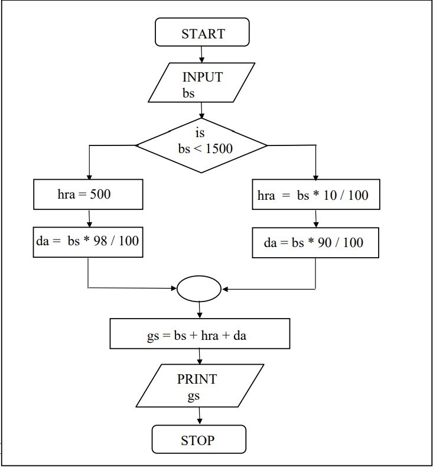

# Decision Control Structure

- Three major decision making instrucitons in C :
    - if
    - if-else
    - switch 
    - (some what less important) conditional operators 

## Decisions! Decisions!

- By default the instructions in a program are executed sequentially.
- Many a times, we want a set of instructions to be executed in one situation, and an entirely different set of instructions to be executed in another situation. 

## The <i><b>if</b></i> Statement 

```
if( this condition is true )
    execute this statement;
```
- Example :  we express a condition using C’s ‘relational’ operators:
    - The relational operators allow us to compare two values to see whether they are equal to each other, unequal, or whether one is greater than the other.
    
    - While purchasing certain items, a discount of 10% is offered if the quantity purchased is more than 1000. If quantity and price per item are input through the keyboard, write a program to calculate the total expenses
    - [C Program](./totalExpenses.c) <br><br>
    

### The Real Thing

General form of <i><b>if</b></i> statement is : 
```
if(expression)
    statement;
```
- the expression can be any valid expression including a relational expression
- We can even use arithmetic expressions in the if statement.

- In C, non-zero value is considered to be true, whereas 0 is considered to be false.
- -5, 3.14, 10 would be considered to be true.
-  So the issue is not whether the number is integer or float, or whether it is positive or negative. Issue is whether it is zero or non-zero. 

### Multiple Statements within <i><b>if</b></i>

- if multiple statements are to be executed then they must be placed within pair of braces
- Example : The current year and the year in which the employee joined the organization are entered through the keyboard. If the number of years for which the employee has served the organization is greater than 3 then a bonus of Rs. 2500/- is given to the employee. If the years of service are not greater than 3, then the program should do nothing.
    - [C Program](./Bonus.c) <br><br>
    

## The <i><b>if-else</b></i> Statement

- else statement helps to executes another group of statements if the expression evaluates to false
- Example : In a company an employee is paid as under: <br>
    If his basic salary is less than Rs. 1500, then HRA = 10% of basic salary and DA = 90% of basic salary. If his salary is either equal to or above Rs. 1500, then HRA = Rs. 500 and DA = 98% of basic salary. If the employee's salary is input through the keyboard write a program to find his gross salary. 
    - [C Program]() <br><br>
    


### Nested <i><b>if-else</b></i>

```
main()
{
	int i;
	printf("Enter either 1 or 2");
	scanf("%d", &i)

	if(i == 1){
		printf("You would go to heaven!");
	}else{
		if(i == 2)
			printf("Hell was created with you in mind");
		else
			printf("How about mother earth!");
	}
}
```


### Forms of <i><b>if</b><i>

```
if ( condition )
    do this;
```
```
if ( condition )
{
    do this;
    and this;
}

```
```
if ( condition )
    do this;
else
    do this;
```
```
if ( condition )
{
    do this;
    and this;
}
else
{
    do this;
    and this;
}
```
```
if ( condition )
    do this;
else
{
    if ( condition )
        do this;
    else
    {
        do this;
        and this;
    }
}
```
```
if ( condition )
{
    if ( condition )
        do this ;
    else
    {
        do this ;
        and this ;
    }
}
else
    do this ; 
```

## Use of Logical Operators

- C allowes three logical operators : && (AND), || (OR), ! (NOT).
- Don’t use the single symbol | and &. These single symbols also have a meaning.
-  The first 2 operators allowd us to combine 2 or more condition in an <i><b>if</b></i> Statement.
- Example : The marks obtained by a student in 5 different subjects are input through the keyboard. The student gets a division as per the following rules :<br>
Percentage above or equal to 60 - First division<br>
Percentage between 50 and 59 - Second division<br>
Percentage between 40 and 49 - Third division<br>
Percentage less than 40 - Fail<br>
Write a program to calculate the division obtained by the student.
    - [C Program (Method-I)](./divisionMethodOne.c)
    - As the number of conditions go on increasing the level of indentation also goes on increasing.
    - Care needs to be exercised to match the corresponding <i><b>if</b></i>s and <i><b>else</b></i>s
    - Care needs to be exercised to match the corresponding pair of braces
    - [C Program (Method-II)](./divisionMethodTwo.c)

### The <i><b>else if</b></i> Clause

```
/* else if ladder demo */
main()
{
    int m1, m2, m3, m4, m5, per;
	
	per = ( m1 + m2 + m3 + m4 + m5) / 5;

	if ( per >= 60 )
		printf("First division\n");
	else if ( per >= 50 )
		printf("Second division\n");
	else if ( per >= 40 )
		printf("Third division\n");
	else
		printf("Fail\n");
}
```
- The last else goes to work only if all conditions fail
- The else if clause is nothing different. It is just a way of rearranging the else with the if that follows it.
```
if (i == 2)
    printf("With you ....");
else
{
    if (j == 2)
        printf("...all the time");
}
```
```
if (i == 2)
    printf("With you...");
else if (j == 2)
    printf ("....All the time");
```

### The <b>!</b> Operator

- This operator reverses the result of the expression it operates on.
- if the expression evaluates to a non-zero value, then applying <b>!</b> operator to it results into a 0
- if the expression evaluates to a non-zero value, then applying <b>!</b> operator to it results into a 0


### Hierarchy of Operators Revisited


## A Word of Caution

```
main( )
{
    int i ;
    printf ( "Enter value of i " ) ;
    scanf ( "%d", &i ) ;
    if ( i = 5 )
        printf ( "You entered 5" ) ;
    else
        printf ( "You entered something other than 5" ) ;
}

Output
Enter value of i 200
You entered 5
Enter value of i 9999
You entered 5 
```
- As the condition written is wrong , it gets reduced to  <i><b>if ( 5 )</b></i> irrepective of what you supply  as the value of i.
- In C 'Truth' is always non-zero , whereas 'falsify' is always zero
- <i><b>if ( 5 )</b></i> always evaluates to true ad hence the result

## The Conditional Operators

- the conditional operators <i><b>?</b></i> and <i><b>:</b></i> are sometimes called ternary opertors since they take three arguments
```
expresion 1 ? expression 2 : expression 3
```
 - if expression 1 is true (that is, if its value is non-zero), then the value returned will be expression 2, otherwise the value returned will be expression 3
```
y = ( x > 5 ? 3 : 4);
```
- conditional operators can be nested
``` 
big = ( a > b ? ( a > c ? 3 : 4) : ( b > c ? 6 : 8 ));
```
- Check out the following conditional expression:
```
a > b ? g = a : g = b ;
```
- This will give you an error ‘Lvalue Required’. The error can
be overcome by enclosing the statement in the : part within a
pair of parenthesis. This is shown below:
```
a > b ? g = a : ( g = b ) ;
```
- In absence of parentheses the compiler believes that b is being
assigned to the result of the expression to the left of second =.
Hence it reports an error
 ## Exercise
