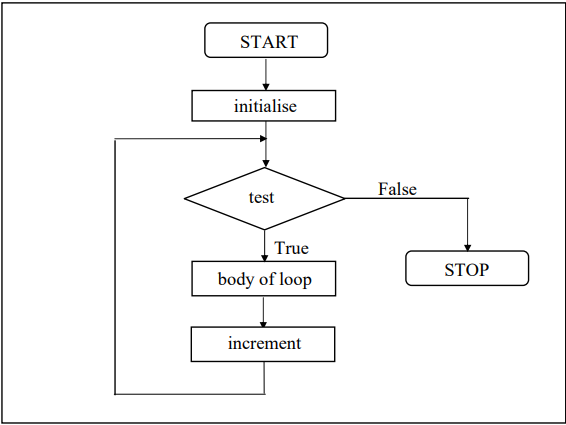

# The Loop Control Structure

## Loops

- The versatility of the computer lies in its ability to perform a set of instructions repeatedly.
- This repetitive operation is done through a loop control instruction
- There are three methods by way of which we can repeat a part of a program : 
    - (a) Using a <i><b>for</b></i> statement
    - (b) Using a <i><b>while</b></i> statement
    - (c) Using a <i><b>do-while</b></i> statement

## The <i><b>while</b></i> Loop

- The <i><b>while</b></i> loop is ideally suited for cases when we want to do something for fixed number of times.
```
/* Calculation of simple interest for 3 sets of p, n and r */
main()
{
    int p, n, count;
    float r, si;
    count = 1;
    while(count < = 3) // as long as this condition is true, body of while loop keep getting executed repeatedly
    {
        // body of while loop
        printf("\nEnter values of p, n and r");
        scanf("%d %d %f, &p, &n, &r);
        si = p * n * r / 100;
        printf("Simple interest = Rs %f", si);

        count = count + 1; // many a times called as loop counter or index variable
    }
}
```
- the flowchat shows general operations of while loop  :


### Tips and Traps : 
- 
    ```
    intialise loop counter;
    while( test loop counter using a condition )
    {
        do this;
        and this;
        increment loop counter;
    }
    ```
- statements within while loop gets executed till condition remains true, the moment condition changes to false control is passed to first statement that follows
- the condition may use relation or logical operators
- the condition must eventually become false otherwise it would execute forever
- keep in mind the range of data types when evaluating the condition, example the below snippet is a infinite loop
```
    main()
    {
    int i = 1;
        while(i <= 32767) // 32767 + 1 will give integer overflow and make it a value -32678 which will be considered as true
        {
            printf("%d\n", i);
            i = i + 1;
        }
    }
 ```
- semicolons , below example is another indefinite loop as i is not incremented
```
    main()
    {
        int i = 1;
        while(i<=10);
        {
            printf("%d\n", i);
            i = i + 1;
        }
    }
```

### More Operators

```
main()
{
    int i = 1;
    while(i <= 10)
    {
        printf("%d\n", i);
        i++;
    }
}
```
- The <i><b>++</b></i> operator is an increment operator which increments the value of <i><b>i</b></i> by 1, everytime the statement <i><b>i++</b></i> gets executed
- similarly , we have decrement operator <i><b>--</b></i>
- never use <i><b>i+++</b></i> , C doesn't recognize the operator <i><b>+++</b></i>
```
main()
{
    int i=  1;
    while(i <= 10)
    {
        printf("%d\n" , i);
        i += 1;
    }
}
```
- <i><b>+=</b></i> is a compound assignment operator, which increments the value  of <i><b>i</b></i> by 1.
- Other compound operator are <i><b>-=</b></i>, <i><b>*=</b></i>, <i><b>/=</b></i>, <i><b>%=</b></i>
```
main()
{
    int i = 0;
    while(i++ < 10)
    {
        printf("%d\n" , i);
    }
}
```
- In this statement <i><b>while(i++ < 10)</b></i> , firstly comparison of value of <i><b>i</b></i> with 10 is performed and then the incrementation of <i><b>i</b></i> takes place
- since increment happens after comparison, it is called as post-incrementation.
```
main()
{
    int i = 0;
    while(++i <= 10){
        printf("%d\n", i);
    }
}
```
- In this statement <i><b>while(++i <= 10)</b></i>, firstly incrementation of <i><b>i</b></i> takes place and then comparison of value of <i><b>i</b></i> with 10.
- since the incrementation of <i><b>i</b></i> happens before its usage , it is called the pre-incrementation operator.

## The <i><b>for</b></i> Loop

- General form of for statement :
```
for (initialise counter; test counter; increment counter)
{
    do this;
    and this;
    and this;
}
```

```
main()
{
    int p, n, count;
    float r, si;
    for(count = 1; count <= 3; count = count + 1)
    {
        printf("Enter values of p, n and r");
        scanf("%d %d %f", &p, &n, &r);

        si = p * n * r / 100;
        printf("Simple Interest = Rs %f\n", si);
    }
}
```


- 

```
main()
{
    int i;
    for(i = 1; i <= 10; i = i + 1)
        printf("%d\n", i);
}
```
- <i><b>i++</b></i> or <i><b>i += 1</b></i> can also be used instead of <i><b>i++</b></i>

```
main()
{
    int i;
    for(i = 1; i <= 10;)
    {
        printf("%d\n", i);
        i = i + 1;
    }
}
```
- here increment is done within the body of for loop
- inspite of this semicolon is necessary

```
main()
{
    int i = 1;
    for(;i <= 10; i = i + 1)
        printf("%d\n", i);
}
```
- initialisation is done in declaration itself, but still semicolon is needed.

```
main()
{
    int i = 1;
    for(;i <= 10;)
    {
        printf("%d\n, i);
        i = i + 1;
    }
}
```
- neither the initialization, nor the incrementation is done, but still 2 semi-colon are necessary

```
main()
{
    int i;
    for(i = 0; i++ < 10;)
        printf("%d\n", i);
}
```
- comparison as well as incrementation is done through the same statement, <i><b>i++ < 10</b></i> 
- first comparison is done and then incrementation

```
main()
{
    int i;
    for(i = 0; ++i <= 10;)
        printf("%d\n", i);
}
```
- comparison as well as incrementation is done through the same statement, <i><b>++i <= 10</b></i> 
- first incrementation is done then comparison

### Nesting of Loops

- The way if statements can be nested, similarly whiles and fors can also be nested
```
/* Demonsration of nest loops */
main()
{
    int r, c, sum;
    for(r = 1; r <= 3; r++)
    {
        for(c = 1;c <= 2; c++)
        {
            sum = r + c;
            printf("r = %d c = %d sum = %d\n", r, c, sum);
        }
    }
}
```
- for each value of r the inner loop is cycled through twice, with the variable c taking values 1 to 2.
- The inner loop terminates when the value of c exceeds 2 , and the outer loop terminates when the value of r exceeds 3.

### Multiple Initialisations in the <i><b>for</b></i> Loop

- The initialisation expression of the for loop can contain more than
one statement separated by a comma. For example,
`for ( i = 1, j = 2 ; j <= 10 ; j++ ) `
- Multiple statements can also be used in the incrementation expression of for loop; i.e., you can increment (or decrement) two or more variables at the same time. 
- However, only one expression is allowed in the test expression. This expression may contain several conditions linked together using logical operators


## The Odd Loop

- <i><b>do-while</b></i> is usefull when we don't know beforehand how many times the statements in the loop are to be executed.
```
/* Execution of a loop an unknown number of times */
main()
{
    char another;
    int num;
    do
    {
        printf("Enter a number ");
        scanf("%d", &num);
        printf("square of %d is %d", num, num * num);
        printf("\nWant to enter another number y/n");
        scanf("%c", &another);
    }while(another == 'y')
}
```
- The loop ensure that the statement gets executed atleast once even if n is supplied first time itself
- This can accomplished usinf <i><b>for</b></i> and <i><b>while</b></i> loops as well.
```
/* odd loop using a for loop */
main( )
{
    char another = 'y' ;
    int num ;
    for ( ; another == 'y' ; )
    {
        printf ( "Enter a number " ) ;
        scanf ( "%d", &num ) ;
        printf ( "square of %d is %d", num, num * num ) ;
        printf ( "\nWant to enter another number y/n " ) ;
        scanf ( " %c", &another ) ;
    }
}
/* odd loop using a while loop */
main( )
{
    char another = 'y' ;
    int num ;
    while ( another == 'y' )
    {
        printf ( "Enter a number " ) ;
        scanf ( "%d", &num ) ;
        printf ( "square of %d is %d", num, num * num ) ;
        printf ( "\nWant to enter another number y/n " ) ;
        scanf ( " %c", &another ) ;
    }
} 
```
## The <i><b>break</b></i> Statement

- The keyword <i><b>break</b></i> will allo us to jump out of  aloop instantly, without waiting to get back to the conditional test.
- Whe break is encountered, control automatically passes to the first statement after the 

```
main()
{
    int num, i;
    printf("Enter a number");
    scanf("%d", &num);

    i = 2;
    while(i <= num - 1){
        if(num %i == 0){
            printf("Not a prime number");
            break;
        }
        i++;
    }
    if(i == num){
        printf("Prime number");
    }
}
```

## The <i><b>continue</b></i>

- <i><b>continue</b></i> keyword allows us to take control to the beginning of the loop , by passing the statement inside the loop, which haev not yet been executed
- A continue is usually associated with an if
```
main()
{
    int i, j;
    for(i = 1; i <= 2; i++)
    {
        for(j = 1; j <= 2; j++)
        {
            if(i == j)
                continue;

            printf("\n%d %d", i, j);
        }
    }
}
```

## The <i><b>do-while</b></i> Loop

- 
```
do
{
    this;
    and this;
    and this;
    and this;
}while(this condition is true)
```
- <i><b>while</b></i> tests the condition before executing any of the statements within <i><b>while</b></i> loop.
- <i><b>do-while</b></i> tests the condition after having executed the statements within the loop. 


## Exercise

### <i><b>while</b></i> Loop
- [A]
    - (a)
        - 0<br> 1<br> 2<br> 3<br> 4<br> 5<br> 6<br> 7<br> 8<br> 9<br> 10<br>
    - (b)
        - 1<br> 2<br> 3<br> 4<br> 5<br> 6<br> 7<br> 8<br> 9<br> 10<br>
