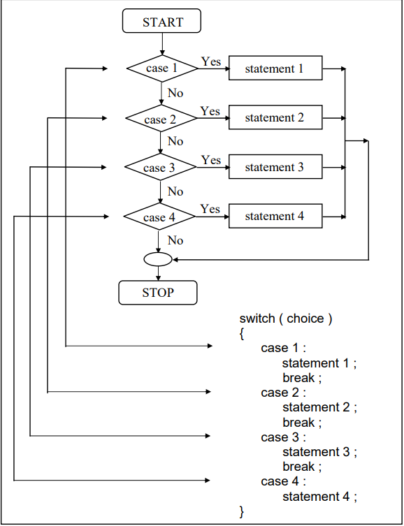

# The Case Control Structure

## Decision Using <i><b>switch</b></i>

- <i><b>switch</b></i> or <i><b>switch-case-default</b></i> statement allows us to make a decision from number of choices
- General form :
```
switch(integer expression)
{
    case constant 1:
        do this; // any valid C statement
    case constant 2:
        do this;
    case constant 3:
        do this';
    default:
        do this;
}
```
- the integer expression could be any expression that yield's an integer value
- the value given by integer expression is matched one by one against constant value that follow case statement
- when match is found, the program executes following <i><b>case</b></i> and all subsequent <i><b>case</b></i> and <i><b>default</b></i> statement as well.
- If no match is found then only <i><b>default</b></i> statements are executed
```
main( )
{
    int i = 2 ;
    switch ( i )
    {
        case 1 :
            printf ( "I am in case 1 \n" ) ;
        case 2 :
            printf ( "I am in case 2 \n" ) ;
        case 3 :
            printf ( "I am in case 3 \n" ) ;
        default :
            printf ( "I am in default \n" ) ;
    }
} 
OUTPUT :
I am in case 2
I am in case 3
I am in default 
```

-  It is upto you to get out of the switch then and there by using a break statement
-  There is no need for a break statement after the default, since the control comes out of the switch anyway. 
```
main( )
{
    int i = 2 ;
    switch ( i )
    {
        case 1 :
            printf ( "I am in case 1 \n" ) ;
            break;
        case 2 :
            printf ( "I am in case 2 \n" ) ;
            break;
        case 3 :
            printf ( "I am in case 3 \n" ) ;
            break;
        default :
            printf ( "I am in default \n" ) ;
    }
} 
OUTPUT :
I am in case 2
```



## The Tips and Traps

- We can put cases in any order, no need to have a ascending order
```
main()
{
    int i = 22;
    swtich(i)
    {
        case 121:
            printf("Case 121");
            break;
        case 7:
            printf("Case 7");
            break;
        case 22:
            printf("Case 22");
            break;
        default:
            printf("Default");
    }
}
```
- We can use <i><b>char</b></i> values in <i><b>case</b></i> and <i><b>switch</b></i>
- they are actually replaced by the ASCII values of the character constants.
```
main(){
    char c = 'x';
    switch(c){
        case 'v':
            printf("Case v");
            break;
        case 'a':
            printf("Case a");
            break;
        case 'x':
            printf("Case x);
            break;
        default:
            printf("Default");
    }
}
```
- We can set a common set of statements for multiple <i><b>case</b></i>s
- we make use of the fact that once a <i><b>case</b></i> is satisfied the control simply falls through the <i><b>case</b></i> till it doesn't encounter a <i><b>break</b></i> statement
```
main(){
    char ch;
    printf("Enter any alphabet a, b or c");
    scanf("%c", &ch);
    switch(ch){
        case 'a':
        case 'A':
            printf("a as in ashar");
            breal;
        case 'b':
        case 'B':
            printf("b as in brain");
            break;
        case 'c':
        csae 'C':
            printf("c as in cookie");
            break;
        default:
            printf("Default");
    }
}
```

- no need to enclose multiple statement in braces
- every statement must be associated with a case otherwise it will never be executed ( compiler won't give error )
- <i><b>default</b></i> case is not mandatory
- All that we can have after the case is an int constant or a char constant or an expression that evaluates to one of these constants. Even a float is not allowed.


## <i><b>switch</b></i> Versus <i><b>if-else</b></i> Ladder

- Things we won't be able to do with a <i><b>switch</i></b> case:
    - cannot be test for a float expression
    - cases can never have variable expressions
    - multiple cases cannot have same expression

- <i><b>switch</i></b> is faster than an equivalent <i><b>if-else</i></b>, as compiler generates jump table for a sqitch during compilation
- <i><b>if-else</i></b> are slower as they are evaluated at execution time


## The <i><b>goto</i></b> Keyword

```
main()
{
    int goals;
    printf("Enter the number of goals scored against India");
    scanf("%d", &goals);
    if(goals <= 5)
        goto sos;
    else{
        printf("About time soccer players lernt C");
        printf("and said goodbye! adieu! to soccer");
        exit();
    }

    sos:
        printf("To err is human");
}
```
- If the condition is satisfied the goto statement transfers control to the label 'sos' , casusing printf() following sos to be executed

- any number of goto's can take control to same label

## Exercise

- [A]
    - (a)
        - Heart<br>I thought one wears a suite
    
    - (b)
        - I am in case 3 
    
    - (c)
        - Pure Simple Egghead!

    - (d)
        - Customers are dicey<br>Markets are pricey<br>Investors are moody<br>At least employees are good

    - (e)
        - Trapped

    - (f)
        - You entered a and b

    - (g)
        - Feeding fish<br>Weeding grass<br>mending roof<br>Just to survive


- [B]
    - (a)
        - semi-colon after switch statement, making case statement without switch

    - (b)
        - we cannot have conditional expression in case statement

    - (c)
        - we cannot have float in case statement

    - (d)
        - we cannot have conditional expression in case statement

- [C] Write a menu driven program which has following options:<br>
    1. Factorial of a number.<br>
    2. Prime or not<br>
    3. Odd or even<br>
    4. Exit <br>
        - [menuDriven](./code/menuDriven.c)

- [D] Write a program which to find the grace marks for a student using switch. The user should enter the class obtained by the student and the number of subjects he has failed in.<br>
    − If the student gets first class and the number of subjects he failed in is greater than 3, then he does not get any grace.If the number of subjects he failed in is less than or equal to 3 then the grace is of 5 marks per subject.
    − If the student gets second class and the number of subjects he failed in is greater than 2, then he does not get any grace. If the number of subjects he failed in is less than or equal to 2 then the grace is of 4 marks per subject.
    − If the student gets third class and the number of subjects he failed in is greater than 1, then he does not get any grace. If the number of subjects he failed in is equal to 1 then the grace is of 5 marks per subject <br>
    - [graceMarks](./code/graceMarks.c)