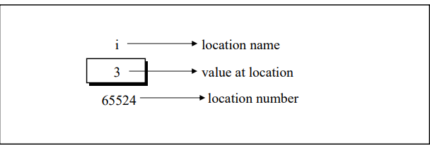
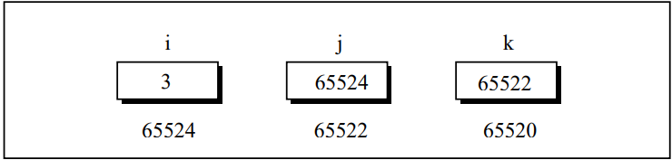
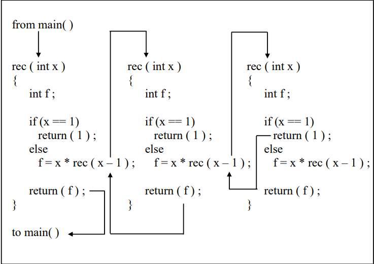
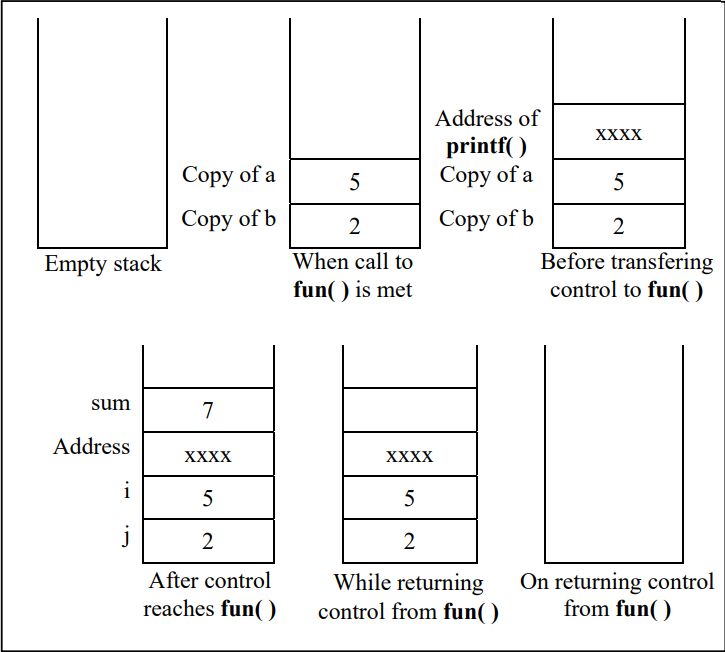

# Functions and Pointers

## What is a Function

- A function is a self-contained block of statements that perform a coherent task of some kind
- using a function is something like hiring a person to do a specific job for you
```
main()
{
    message();
    printf("\nCry, and you stop the monotony!");
}
message()
{
    printf("\nSmile, and the world smiles with you");
}
```
- here <i><b>main()</b></i> itself is a function and through it we are calling the function <i><b>message()</b></i>.
- The activity of <i><b>main()</b></i> is temporarily suspended; it falls asleep while the <i><b>message()</b></i> function wakes up and goes to work. When the <i><b>message()</b></i> function runs out of  statements to execute, the control returns to <i><b>main()</b></i>, which comes to life again and begins executing its code at the exact point where it left off.

- Any C program contains at leat one function
- if program contains only one function then it must be main()
- there is not limit on the number of functions that might be present in a C program
- Each function are called in a sequence specified by the function calls in main()
- Compiler always begins the progra execution with main()
- C program is a collection of one or more funtions
- A function gets called when function name is followed by a semicolon
```
main()
{
    argentina();
}
```
- A function is defined whe function name is followed by a pair of braces in which one or more statements may be present
```
argentina
{
    statement 1;
    statement 2;
    statement 3;
}
```
- Any function can be called from any other function, even main() can be called from other functions
- A function can be called any number of times
- The order in which the functions are defined in a program and the order in which they get called need not necessarily be same
- A function can be called from other function, but a function cannot be defined in another function. Thus, the following program code would be wrong, since argentina( ) is being defined inside another function, main( ).
```
main()
{
    printf("\nI am in main");
    argentina()
    {
        printf("\nI am in argentina");
    }
}
```
- Two types of Functions
    - Library functions
        - commonly required, grouped together and stored in what is called a Library
        - present on disk, written for us by people who write compilers
        - printf(), scanf()
    - User-defined functions
        - argentina(), brazil()

### Why Use Funtions

- Writing functions avoids rewriting the same code over and over again
- If the operation of a program can be divided into separate activities, and each activity placed in a different function, then each could be written and checked more or less independently

## Passing Values between Functions

- The mechanism used to convey information to the function is the `argument`
- `arguments` are sometimes referred to as `parameters`
```
main()
{
    int a, b, c, sum;
    printf("\nEnter any three numbers");
    scanf("%d %d %d", &a, &b, &c);

    sum = calsum(a, b, c);
    printf( "\nSum = %d", sum);

}
calsum(x, y, z)
int x,y, z;
{
    int d;
    d = x + y + z;
    return (d);    
}
```
- here <i><b>a, b, c</b></i> are passed to calsum from main and <i><b>x, y, z</b></i> are collected in calsum() function
- <i><b>a, b, c</b></i> are called `actual arguments` whereas <i><b>x, y, z</b></i> are called as `formal arguments`
- The type and order of actual and formal arguments must be same
- Two methods to declare formal arguments
    - Kernighan and Ritchie (or just K & R) method
    ```
    calsum(x, y, z)
    int x, y, z;
    ```
    - ANSI method ( more commonly used these days )
    ```
    calsum(int x, int y, int z)
    ```
- if the function doesn't return anything closing brace are enough to send back the control where as if we expect function to return something the it is necessary to use return statement
    - on <i><b>return</b></i> statement it immmediately transfers the control back to the calling program
    - it returns the value present in the parentheses after <i><b>return</b></i> , to the calling program.
    - no restriction on number of <i><b>return</b></i> statements , also no restriction that it has to be present at the end
    - Whenever the control returns from a function some value is  definitely returned. If a meaningful value is returned then it should be accepted in the calling program by equating the called function to some variable
    - we should mention keyword `void` if we don't want to return anything from the function
    - A function can return only one value, following are invalid
    ```
    return (a, b);
    return (x, 12);
    ```
    - if value of formal argument is changed int he function , the corresponding change does not take place in the calling function

## Scope Rule of Functions

```
main()
{
    int i = 20;
    display(i);
}
display(int j){
    int k = 35;
    printf("\n%d", j);
    printf("\n%d", k);
}
```
- the scope of a variable is local to the function in which it is defined
- The presence of i is known only to the function main() and not to any other function.
- the variable k is local to the function display() and hence it is not available to main().
- That is why to make the value of i available to display() we have to explicitly pass it to display()

## Calling Convention

- Calling convention indicates the order in which arguments are passed to a function when a function call is encountered. 
- There are two possibilities here:
    - Arguments might be passed from left to right.
    - Arguments might be passed from right to left.

- C language follows the second order
```
fun (a, b, c, d ) ;
```
- In this call it doesn’t matter whether the arguments are passed from left to right or from right to left.
```
int a = 1 ;
printf ( "%d %d %d", a, ++a, a++ ) ;
```
- expected is 1 2 3, but it prints 3 3 1, because of C's calling convention ( right to left)

## One Dicey Issue 

```
#include<conio.h>
clrscr();
gotoxy(10, 20);
ch = getch(a);
```
- Whenever we call the library functions we must write their prototype before making the call.
- This helps the compiler in checking whether the values being passed and returned are as per the prototype declaration
- But since we don’t define the library functions (we merely call them) we may not know the prototypes of library functions.
- example : prototype of all input/output functions are provided in `stdio.h`, and all maths functions are in `math.h`
- on compiling the above would give errors due to mismatch in function call and corresponding prototypes.


```
#include<stdio.h>
int i = 10, j = 20;
printf("%d %d %d", i, j);
printf("%d", i, j);
```
- Now printf() accepts variable number of arguments and even with the mismatch the above call still matches with prototype of printf() present in stdio.h
- At runtime , no variable is matching with last specifier so it will print a garbage value
- for second printf, the format specifier for j is not been mentioned so its value does not get printed

## Advanced Features of Functions

### Function Declaration and Prototypes

- C function by default returns int value
```
main()
{
    float square(float);
    float a, b;
    printf("\nEnter any number");
    scanf("%f", &a);

    b = square(a);
    printf("\nSquare of %f is %f", a, b);
}
float square(float x)
{
    float y;
    y = x * x;
    return (y);
}
```
- If we desire that a function should return a value other than an int, then it is necessary to explicitly mention so in the calling function as well as in the called function
```
float square(float);
```
- This statement is often called the prototype declaration of the square() function, which shows square function receives a float and returns a float.
- We have done the prototype declaration in main() because we have called it from main()
-  we would make only one declaration outside all the functions at the beginning of the program if we have to call the function from several other functions. 
- the `void` keyword comes into picture when we don't want function to return any value

### Call by Value and Call by Reference


- when we pass values of variables to the called function , it is called as `call by value`
- example
    ```
    sum = calsum(a, b, c);
    f = fact(a);
    ```
- Pointers help us to call a function by reference, in ehich we pass th location number /address where variable is store instead of variable value

### An Introduction to Pointers

- when a C programmer says that a certain variable is a “pointer”, what does that mean? 
- It is hard to see how a variable can point to something, or in a certain direction. 

### Pointer Notation

`int i = 3;`  
- The declarationtells C compiler to:
    - Reserve space in memory to hold integer value 
    - Associate the name i with this memory location
    - Store the value 3 at this location


```
main()
{
    int i = 3;
    printf("\nAddress of i = %u", &i);
    printf("\nValue of i = %d", i);
}
```
- `&` used in the first printf is C's `address of` operator, the expression `&i` returns the address of the variable i
- `%u` is a format specifier of unsigned integer
- The other pointer operator available in C is `*`, called the `value at address` operator, it gives the value stored at particular address. It is also called as 'indirection' operator
```
main()
{
    int i = 3;
    printf("\nAddress of i = %u", &i);
    printf("\nValue of i = %d", i);
    printf("\nValue of i = %d", *(&i));
}
```
- we can also store address of a variable in another variable
    - example : j = &i;

- now as j is a variable containing address of another variable, it will be declared as:
    - int *j;
    - this represent j will be used to store address of interger variable

```
main()
{
    int i = 3;
    int *j;
    j = &i;
    printf("\nAdress of i : %u", &i);
    printf("\nAddress of i : %u", j);
    printf("\nAddress of j : %u", j);
    printf("\nValue of j : %u", j);
    printf("\nValue of i : %d", i);
    printf("\nValue of i : %d", *(&i));
    printf("\nValue of i : %d", *j);
}
Address of i = 65524
Address of i = 65524
Address of j = 65522
Value of j = 65524
Value of i = 3
Value of i = 3
Value of i = 3 
```

- some more examples of pointer variables:
    - int *alpha;
    - char *ch; // ch will contain address of a character variable
    - float *s;// s will contain address of a floating point variable

- now we can also store a pointer i.e pointer that contains another pointer's address
    - int i , *j, **k;
    

### Back to Function Calls

- In call by value : each of the actual argument in calling function is copied into corresponding formal arguments of the called function
- with this , changes made to formal arguments have no effect on the actual arguments in the calling function
```
main()
{
    int a = 10, b= 20;

    swapv(a, b);
    printf("\na = %d b = %d", a, b);
}
swapv(int x, int y)
{
    int t;
    t = x;
    x = y;
    y = t;
    printf("\nx = %d y = %d", x, y);
}
x = 20 y = 10
a = 10 b = 20
```

- In call by reference, the address of the actual arguments in the calling function are copied into formal arguments of the called function
- This gives access to the actual arguments and hence would be able to manipulate them
```
main()
{
    int a = 10, b= 20;

    swapr(&a, &b);
    printf("\na = %d b = %d", a, b);
}
swapv(int *x, int *y)
{
    int t;
    t = *x;
    x* = *y;
    *y = t;
}
a = 20 b = 10
```

### Conclusions

- If we want that the value of an actual argument should not get changed in the function being called, pass the actual argument by value
- If we want that the value of an actual argument should get changed in the function being called, pass the actual argument by reference
- If a function is to be made to return more than one value at a time then return these values indirectly by using a call by reference


### Recursion

- A function is called ‘recursive’ if a statement within the body of a function calls the same function
- Factorial of a number is the product of all integers between 1 and that number
    - 4 factorial is 4 * 3 * 2 * 1
    - 4!  = 4 * 3!  ( `!` stands for factorial )
    - As is can be expressed int the form of itself , it can be programmed using recursion
    ```
    main()
    {
        int a, fact;
        printf("\nEnter any number");
        scanf("%d", &a);

        fact = factorial(a);
        printf("Factorial value = %d", fact);
    }
    factorial(int x)
    {
        int f ;
        if( x == 1)
            return (1);
        else
            f = x * factorial(x- 1);
        return (f);
    }
    ```

- the C compiler keeps track of which invocation calls which. These recursive invocations end finally when the last invocation gets an argument value of 1



### Recursion and Stack

- The compiler use a data structure called `stack` for implementing normal as well as recursive function calls
- A stack is Last In First Out (LIFO) data structure
```
main()
{
    int a = 5, b = 2, c;
    c = add(a , b);
    printf("sum = %d",c);
}
add(int i, int j)
{
    int sum;
    sum = i + j;
    return sum;
}
```


- The popping of <b>sum</b> and address is done by fun(), whereas popping of the two integers is done by <b>main()</b>
- This is known as `CDecl Calling Convention`
- There are other calling conventions , which decides the parameters being passed to function are pushed on stack in left-to-right or right-to-left order
- The standard calling convention uses right-to-left order, thus b is pushed first and then a
- The recursive calls are no different. Whenever we make a recursive call the parameters and the return address gets pushed on the stack
- while writing recursive functions you must have an if statement somewhere in the recursive function to force the function to return without recursive call being executed. 
- If you don’t do this and you call the function, you will fall in an indefinite loop, and the stack will keep on getting filled with parameters and the return address each time there is a call. 
- Soon the stack would become full and you would get a run-time error
indicating that the stack has become full. This is a very common
error while writing recursive functions

## Adding Functions to the Library

- We can add uesr-defined functions to the library
- It makes sense in doing so as the functions that are to be added to the library are first compiled and then added
- We can either modify exiting library ( different compilers provide utilities for doing this ) or create out own


## Exercise

- [A]
    - (a)
        - Only stupids use C?<br>nFools too use C!<br>Only stupids use C?... for infinite times
    
    - (b)
        - C to it that C survives<br>C to it that C survives... infinite times

    - (c)
        - 100

    - (d)
        - 4500
    
- [B]
    - (a)
        - cannot return 2 values using return keyword in C
    
    - (b)
        - no error

    - (c)
        - variable a and ch are defiened only in main() and have scope only till main() function, they are not declared in printit by K&R or ANSI method

    - (d)
        - no error

    - (e)
        - cannot define function within function in C

    - (f)
        - no arguments are taken by message() function, still passed

- [C]
    - (a)
        - semi-colon just after function declaration
    
    - (b)
        - 1. The variables commonly used in C functions are available to all the functions in a program. -> <b>False</b>
        - 2. To return the control back to the calling function we must use the keyword return. -> <b>False</b>
        - 3. The same variable names can be used in different functions without any conflict. -> <b>True</b>
        - 4. Every called function must contain a return statement -> <b>False</b>
        - 5. A function may contain more than one return statements -> <b>True</b>
        - 6. Each return statement in a function may return a different value. -> <b>True</b>
        - 7. A function can still be useful even if you don’t pass any  arguments to it and the function doesn’t return any value back. -> <b>True</b>
        - 8. Same names can be used for different functions without any conflict. -> <b>True</b>
        - 9. A function may be called more than once from any other function -> <b>True</b>
        - 10. It is necessary for a function to return some value.  -> <b>False</b>
    
- [D]
    - (a) Write a function to calculate the factorial value of any integer entered through the keyboard. 
        - [factorial](./code/factorial.c)

    - (b) Write a function power ( a, b ), to calculate the value of a raised to b. 
        - [aPowerB](./code/aPowerB.c)

    - (c) Write a general-purpose function to convert any given year into its roman equivalent. The following table shows the roman equivalents of decimal numbers:

    |Decimal|Roman|
    |:-----:|:---:|
    |1      |i|
    |5      |v|
    |10     |x|
    |50     |l|
    |100    |c|
    |500    |d|
    |1000   |m|

    Example - Roman equivalent of 1988 is mdcccclxxxviii<br>Roman equivalent of 1525 is mdxxv 
    
    - [yearToRoman](./code/yearToRoman.c)

    - (d) Any year is entered through the keyboard. Write a function to determine whether the year is a leap year or not. 
        - [leapYear](./code/leapYear.c)

    - (e) A positive integer is entered through the keyboard. Write a function to obtain the prime factors of this number.<br>For example, prime factors of 24 are 2, 2, 2 and 3, whereas prime factors of 35 are 5 and 7.
        - [primeFactors](./code/primeFactors.c)

- [E]
    - (a)
        - 3.000000

    - (b)
        - error - trying to catch a value frm void function

- [F]
    - (a) Write a function which receives a float and an int from main( ), finds the product of these two and returns the product which is printed through main( ).
        - [product](./code/product.c)

    - (b) Write a function that receives 5 integers and returns the sum, average and standard deviation of these numbers. Call this function from main() and print the results in main().
        - [sumAvgSTD](./code/sumAvgSTD.c)
        
    - (c) Write a function that receives marks received by a student in 3 subjects and returns the average and percentage of these marks. Call this function from main( ) and print the results in main( ). 
        - [avgPercent](./code/avgPercent.c)

- [G]
    - (a)
        - 5 2
    
    - (b)
        - 25 4

    - (c)
        - 16 2

    - (d)
        - 6487564 6487564 6487564<br>13.500000 13.500000 13.500000 13.500000 13.500000


- [H]
    - (a)
        - c variable is declared by K & R style for parameters bu c is not a parameter, it should have been declared inside the function

    - (b)
        - no error ( but won;t give the expected output sa addresses are not catched as pointers)

    - (c)
        - parameter is not declared correctly

    - (d)
        - function returns an integer and is catched as pointer in main function

- [I]
    - (a)
        - C adds wings to your thoughts
    
    - (b)
        - 1<br>2<br>3<br>4<br>5


- [J]
    - (a) A 5-digit positive integer is entered through the keyboard, write a function to calculate sum of digits of the 5-digit number: <Br>(1) Without using recursion<br>(2) Using recursion
        - [sumOfInteger](./code/sumOfInteger.c)
        - [sumOfIntegerRec](./code/sumOfIntegerRec.c)

    - (b) A positive integer is entered through the keyboard, write a program to obtain the prime factors of the number. Modify the function suitably to obtain the prime factors recursively.
        - [primeFactorsRec](./code/primeFactorRec.c)

    - (c) Write a recursive function to obtain the first 25 numbers of a Fibonacci sequence. In a Fibonacci sequence the sum of two successive terms gives the third term. Following are the first few terms of the Fibonacci sequence:<br>1 1 2 3 5 8 13 21 34 55 89...
        - [fibonacciRec](./code/fibonacciRec.c)

    - (d) A positive integer is entered through the keyboard, write a function to find the binary equivalent of this number using recursion. 
        - [binaryEquivalent](./code/binaryEquivalent.c)

    - (e) Write a recursive function to obtain the running sum of first 25 natural numbers.
        - [sumOfNatural](./code/sumOfNatural.c)

    - (f) Write a C function to evaluate the series to five significant digits<br>sin(x) = x − (x3 / 3!) + (x5 / 5!) − (x7 / 7!) + ...<br>to five significant digits.
        - [sinSeries](./code/sinSeries.c)

    - (g) Given three variables x, y, z write a function to circularly shift their values to right. In other words if x = 5, y = 8, z = 10 after circular shift y = 5, z = 8, x =10 after circular shift y = 5, z = 8 and x = 10. Call the function with variables a, b, c to circularly shift values. 
        - [circularShift](./code/circularShift.c)

    - (h) Write a function to find the binary equivalent of a given decimal integer and display it.
        - [binaryEquivalent](./code/binaryEquivalent.c)

    - (i) If the lengths of the sides of a triangle are denoted by a, b, and c, then area of triangle is given by <br>area = S(S − a)(S − b)(S − c)<br>where, S = ( a + b + c ) / 2 

        - [areaOfTriangle](./code/areaOfTriangle.c)

    - (j) Write a function to compute the distance between two points and use it to develop another function that will compute the area of the triangle whose vertices are A(x1, y1), B(x2, y2), and C(x3, y3). Use these functions to develop a function which returns a value 1 if the point (x, y) lines inside the triangle ABC, otherwise a value 0. 

        - [operationOnTriangle](./code/operationOnTriangle.c)

    - (k) Write a function to compute the greatest common divisor given by Euclid’s algorithm, exemplified for J = 1980, K = 1617 as follows:<br>
    1980 / 1617 = 1 1980 – 1 * 1617 = 363<br>
    1617 / 363 = 4 1617 – 4 * 363 = 165<br>
    363 / 165 = 2 363 – 2 * 165 = 33<br>
    5 / 33 = 5 165 – 5 * 33 = 0<br>
    Thus, the greatest common divisor is 33<br>
        - [Euclid's Algorithm](./code/EuclidsAlgorithm.c)