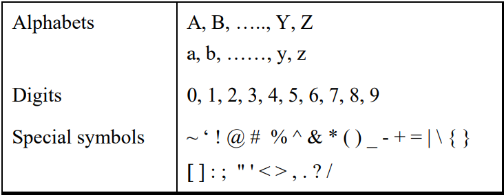

# Getting Started

## What is C

- C is a programming language developed at AT & T’s Bell Laboratories of USA in 1972. 
- It was designed and written by a man named Dennis Ritchie.

## Getting Started with C

- Communicating with a computer involves speaking the language
the computer understands, which immediately rules out English as
the language of communication with computer. 
- The classical method of learning English is to first learn
the alphabets used in the language, then learn to combine these
alphabets to form words, which in turn are combined to form
sentences and sentences are combined to form paragraphs.
- Learning C is similar and easier.

### The C Character Set

- A character denotes any alphabet, digit or special symbol used to
represent information.

- 

### Constants , Variables and Keywords

- The alphabets, numbers and special symbols when properly
combined form constants, variables and keywords.
- A constant is an entity that
doesn’t change whereas a variable is an entity that may change. 

### Types of C Constants

- Primary Constants
    - Integer Constant
    - Real Constant
    - Character Constant

- Secondary Constants
    - Array
    - Pointer
    - Structure
    - Union
    - Enum

### Rules for Constructing Integer Constants

- must have digit
- must not have decimal point
- either poistive or negative
- no sign precedes then assumed positive
- no comma or blanks allowed
- ranges –32768 to 32767 (for 16-bit compiler, depends on complier ).

### Rules for Constructing Real Constants

- also called Floating point constants 
- can be written in two forms
    - Fractional
    - Exponential
- must have atleast one digit
- have decimal point
- could be positive or negative
- no comma or blank allowed

### Rules for Constructing Character Constants

- a single alphabet or a special symbol ot a single digit enclosed within single inverted commas
- maximum length = 1

### Types of C Variables

- Variable names are names given to locations in memory.
- a particular type of variable can hold only the same type of constant

### Rules for Constructing Variable Names

- A variable name is any combination of 1 to 31 alphabets, digits or underscores
- The first character in the variable name must be an alphabet or underscore. 
- No commas or blanks allowed
- No special symbol other than underscore
- C ompiler distinguishes Primary and Secondary variable by the type with which its defined
- Create meaningful variable names

### C Keywords

- Keywords are the words whose meaning has already been explained to the C compiler (or in a broad sense to the computer)
- Keywords cannot be used as variable name ( even if compiler allows safer not to mix up)
- Keywrods also known as Reversed words
- 32 keywords in C
- 
- some other keywords are provided by Vendors like Microsoft, Borland but ANSI has suggested to put two underscores before them to identify them.

## The First C Program

- Rules : 
    - Each instruction is written as separate statement , so a complete program is a series of statements
    - the statements should be in a order in which they need to be executed, unleass it needs a deliberate jump / transfer
    - every statement must end with semi-colon `;` , acts as a statement terminator
- [Program to Calculate Simple Interest](./Program_to_Calculate_Simple_Interest.c)
- Comment about the program should be enclosed within `/* */`
- Good to add comments wherever required which increases readablity
- `main` is a name given to a set of statments enclosed with pair of braces, technically speaking main() is a function.
- Variable to be used must be declared beforehand
- C has 45 operators but no operator for exponentiation
- We use inbuilt function to display output on the screen, one such function is printf()
    - `printf("format string", list of variables);`
    - `%d` for integer
    - `%c` for characters
    - `%f` for real values
- Another one is `\n` , it is called newline and used ti take cursor to the next line, so  you get output split over two lines.

## Compilation and Execution
